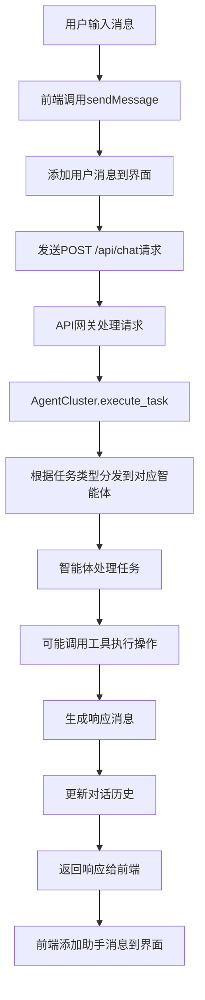

# 智能家居智能体 - 架构说明文档

## 1. 整体架构设计

### 1.1 系统架构概览

智能家居智能体采用分层架构设计，从用户交互到数据持久化形成完整的处理链路。系统由以下核心层次组成：

```
┌──────────────────────────────────────────────────────────────────────┐
│                         用户交互层 (User Interface)                    │
│  ┌─────────────┐  ┌─────────────┐  ┌─────────────┐                  │
│  │  前端Web界面  │  │  API接口    │  │  命令行接口  │                  │
│  └──────┬──────┘  └──────┬──────┘  └──────┬──────┘                  │
└─────────┼────────────────┼────────────────┼──────────────────────────┘
          │                │                │
          ▼                ▼                ▼
┌──────────────────────────────────────────────────────────────────────┐
│                     会话管理层 (Session Manager)                       │
│  ┌─────────────────────────────────────────────────────────────────┐ │
│  │                   会话注册表与上下文管理                          │ │
│  └─────────────────────────────────────────────────────────────────┘ │
└────────────────────────────────────┬──────────────────────────────────┘
                                     │
                                     ▼
┌──────────────────────────────────────────────────────────────────────┐
│                     智能体执行层 (Agent Execution Layer)               │
│  ┌─────────────┐  ┌─────────────┐  ┌─────────────┐                  │
│  │  智能体集群  │  │  任务调度器  │  │  技能管理器  │                  │
│  └──────┬──────┘  └──────┬──────┘  └──────┬──────┘                  │
│         │                │                │                           │
│         ▼                ▼                ▼                           │
│  ┌─────────────┐  ┌─────────────┐  ┌─────────────┐                  │
│  │  对话智能体  │  │  设备控制智能体 │  │  任务管理智能体 │            │
│  └──────┬──────┘  └──────┬──────┘  └──────┬──────┘                  │
└─────────┼────────────────┼────────────────┼──────────────────────────┘
          │                │                │
          ▼                ▼                ▼
┌──────────────────────────────────────────────────────────────────────┐
│                     记忆管理层 (Memory Management Layer)              │
│  ┌─────────────┐  ┌─────────────┐  ┌─────────────┐                  │
│  │  长期记忆   │  │  用户画像   │  │  每日记忆   │                  │
│  └──────┬──────┘  └──────┬──────┘  └──────┬──────┘                  │
└─────────┼────────────────┼────────────────┼──────────────────────────┘
          │                │                │
          ▼                ▼                ▼
┌──────────────────────────────────────────────────────────────────────┐
│                     工具执行层 (Tool Execution Layer)                  │
│  ┌─────────────┐  ┌─────────────┐  ┌─────────────┐                  │
│  │  设备控制   │  │  文件操作   │  │  网络请求   │                  │
│  └─────────────┘  └─────────────┘  └─────────────┘                  │
└──────────────────────────────────────────────────────────────────────┘
          │
          ▼
┌──────────────────────────────────────────────────────────────────────┐
│                     数据持久化层 (Data Persistence Layer)              │
│  ┌─────────────┐  ┌─────────────┐  ┌─────────────┐                  │
│  │  文件存储   │  │  JSON配置   │  │  日志记录   │                  │
│  └─────────────┘  └─────────────┘  └─────────────┘                  │
└──────────────────────────────────────────────────────────────────────┘
```

### 1.2 核心设计原则

- **会话隔离**：每个对话窗口拥有独立的上下文和记忆空间，通过唯一的session_id进行标识和隔离
- **记忆共享**：全局知识（如用户画像、长期记忆）对所有对话窗口可见，确保智能体对用户的一致性认知
- **动态继承**：新对话窗口自动继承用户画像和全局记忆，保持对话的连贯性
- **模块化设计**：系统采用高度模块化的架构，各组件职责明确，便于扩展和维护
- **可插拔式技能**：技能系统采用可插拔设计，支持动态加载和扩展功能

## 2. 核心组件与模块划分

### 2.1 API网关 (API Gateway)

**位置**：`src/gateway/api_gateway.py`

**功能**：
- 提供RESTful API接口，处理前端和外部系统的请求
- 管理HTTP路由和请求处理
- 实现CORS中间件，支持跨域请求
- 集成静态文件服务和模板渲染
- 作为系统的统一入口点

**核心方法**：
- `_setup_routes()`：配置所有API路由
- `run()`：启动API服务器

### 2.2 会话管理器 (Session Manager)

**位置**：`src/agent/session_manager.py`

**功能**：
- 管理对话会话的创建、更新、删除
- 维护会话注册表（chats.json）
- 管理会话上下文和对话历史
- 实现会话的持久化和恢复

**核心方法**：
- `create_session()`：创建新会话
- `update_session_name()`：更新会话名称
- `delete_session()`：删除会话
- `save_session_context()`：保存会话上下文
- `load_session_context()`：加载会话上下文
- `get_conversation_history()`：获取对话历史

### 2.3 智能体集群 (Agent Cluster)

**位置**：`src/agents/agent_cluster.py`

**功能**：
- 管理多个专业智能体的协同工作
- 负责任务的分发和执行
- 协调不同智能体之间的通信
- 提供智能体状态监控

**核心组件**：
- 对话智能体 (Conversation Agent)
- 设备控制智能体 (Device Control Agent)
- 任务管理智能体 (Task Manager Agent)
- 安全智能体 (Security Agent)
- 记忆管理智能体 (Memory Agent)

### 2.4 记忆管理器 (Memory Manager)

**位置**：`src/agent/memory_manager.py`

**功能**：
- 管理长期记忆（MEMORY.md）
- 管理用户画像（PROFILE.md）
- 管理每日记忆（memory/YYYY-MM-DD.md）
- 实现记忆蒸馏和摘要功能

**核心方法**：
- `read_long_term_memory()`：读取长期记忆
- `write_long_term_memory()`：写入长期记忆
- `read_soul()`：读取人格文件
- `distill_memory()`：执行记忆蒸馏

### 2.5 技能管理器 (Skill Manager)

**位置**：`src/skills/skill_manager.py`

**功能**：
- 管理和加载各种技能模块
- 提供技能的注册和调用机制
- 支持技能的动态发现和加载

**核心技能类型**：
- 核心技能（如调用LLM、日志操作）
- 设备技能（如灯光控制）
- 记忆技能（如记忆蒸馏、回忆）
- 搜索技能（如关键词搜索、向量搜索）
- 任务技能（如创建提醒、调度任务）

### 2.6 前端应用 (Frontend Application)

**位置**：`src/frontend/`

**功能**：
- 提供用户友好的Web界面
- 实现对话管理（创建、重命名、删除对话）
- 支持设备控制操作
- 提供记忆管理和任务管理功能
- 实现会话切换和历史记录显示

**核心文件**：
- `static/js/app.js`：前端应用逻辑
- `static/css/style.css`：前端样式
- `templates/index.html`：前端页面模板

## 3. 技术栈选型

| 类别 | 技术/框架 | 版本 | 用途 | 来源 |
|------|-----------|------|------|------|
| 后端 | Python | 3.11 | 主要开发语言 | requirements.txt |
| Web框架 | FastAPI | - | API网关和Web服务 | src/gateway/api_gateway.py |
| 模板引擎 | Jinja2 | - | 前端页面渲染 | src/gateway/api_gateway.py |
| 静态文件 | 原生HTML/CSS/JS | - | 前端界面 | src/frontend/ |
| 数据存储 | 文件系统 | - | 会话和记忆存储 | src/agent/session_manager.py |
| 配置管理 | JSON | - | 系统配置 | config/ |
| 大模型集成 | 七牛LLM | - | 智能对话能力 | src/ai/qiniu_llm.py |
| 部署 | uvicorn | - | ASGI服务器 | src/gateway/api_gateway.py |

## 4. 数据流向与系统交互流程

### 4.1 对话创建流程

```mermaid
flowchart TD
    A[用户点击"新建对话"] --> B[前端调用createNewChat]
    B --> C[发送POST /api/chats请求]
    C --> D[API网关处理请求]
    D --> E[SessionManager.create_session]
    E --> F[生成session_id]
    F --> G[初始化会话上下文]
    G --> H[保存到chats.json]
    H --> I[返回新会话信息]
    I --> J[前端更新对话列表]
    J --> K[切换到新对话]
```

### 4.2 消息处理流程



### 4.3 会话切换流程

```mermaid
flowchart TD
    A[用户点击对话列表项] --> B[前端调用switchChat]
    B --> C[设置currentSessionId]
    C --> D[清空聊天区域]
    D --> E[发送GET /api/chats/{session_id}/history请求]
    E --> F[API网关处理请求]
    F --> G[SessionManager.get_conversation_history]
    G --> H[返回对话历史]
    H --> I[前端渲染对话历史]
    I --> J[更新对话列表活跃状态]
```

### 4.4 记忆管理流程

```mermaid
flowchart TD
    A[用户与智能体交互] --> B[对话历史累积]
    B --> C[定期触发记忆蒸馏]
    C --> D[提取关键信息]
    D --> E[更新长期记忆(MEMORY.md)]
    E --> F[压缩会话历史]
    F --> G[保持会话历史在合理长度]
    
    H[用户手动编辑记忆] --> I[保存到对应记忆文件]
    I --> J[更新全局记忆状态]
```

## 5. 关键设计决策

### 5.1 会话管理设计

**决策**：采用基于文件系统的会话存储方案，使用chats.json作为会话注册表

**原因**：
- 简单直接，无需额外的数据库依赖
- 便于手动编辑和调试
- 适合个人或小型部署场景
- 数据结构清晰，易于理解和维护

**影响**：
- 性能：对于大量会话的场景可能存在性能瓶颈
- 并发：多用户同时操作可能导致文件冲突
- 扩展性：不易于水平扩展

### 5.2 记忆分层设计

**决策**：实现三层记忆结构（全局记忆、每日日志、会话局部上下文）

**原因**：
- 全局记忆：存储用户画像和长期知识，确保所有对话的一致性
- 每日日志：按日期记录所有对话的重要事件，便于回顾和搜索
- 会话局部上下文：严格隔离的对话历史，确保对话的独立性

**影响**：
- 优势：提供了灵活的记忆管理机制，既保证了对话的独立性，又维护了全局知识的一致性
- 挑战：需要合理设计记忆蒸馏策略，避免记忆膨胀

### 5.3 智能体架构设计

**决策**：采用多智能体集群架构，每个智能体负责特定领域的任务

**原因**：
- 专业化：每个智能体专注于特定领域，提高处理效率和质量
- 可扩展性：便于添加新的智能体和功能
- 容错性：单个智能体故障不影响整个系统
- 灵活性：可以根据任务类型动态选择合适的智能体

**影响**：
- 复杂性：增加了系统的复杂性和协调成本
- 资源消耗：多个智能体同时运行会增加资源消耗
- 一致性：需要确保不同智能体对用户的认知一致

### 5.4 技能系统设计

**决策**：采用可插拔的技能系统，支持动态加载和扩展

**原因**：
- 灵活性：可以根据需要添加新的技能
- 可维护性：技能模块化，便于单独开发和测试
- 可复用性：技能可以在不同智能体间共享
- 安全性：可以对技能进行权限控制

**影响**：
- 架构复杂性：需要设计合理的技能注册和调用机制
- 性能：技能加载和调用可能带来额外开销
- 兼容性：需要确保技能之间的兼容性

## 6. 系统配置与部署

### 6.1 配置文件结构

```
config/
├── modules/
│   ├── device_config.json  # 设备配置
│   └── model_config.json   # 模型配置
├── README.md              # 配置说明
└── config_manager.py      # 配置管理模块
```

### 6.2 部署流程

1. **环境准备**：
   - 安装Python 3.11
   - 安装依赖：`pip install -r requirements.txt`

2. **配置设置**：
   - 修改`config/modules/`下的配置文件
   - 配置大模型API密钥

3. **启动服务**：
   - 运行`python app.py`
   - 服务默认运行在`http://localhost:8000`

4. **访问界面**：
   - 打开浏览器访问`http://localhost:8000`

### 6.3 目录结构

```
Home-AI-Agent/
├── .trae/               # 开发工具相关
├── YUEYUE/              # 智能体人格相关
├── config/              # 配置文件
├── docs/                # 文档
├── examples/            # 示例代码
├── src/                 # 源代码
│   ├── agent/           # 智能体核心
│   ├── agents/          # 智能体集群
│   ├── ai/              # 大模型集成
│   ├── communication/   # 通信模块
│   ├── database/        # 数据库模块
│   ├── frontend/        # 前端应用
│   ├── gateway/         # API网关
│   ├── scheduler/       # 任务调度
│   ├── security/        # 安全模块
│   ├── skills/          # 技能系统
│   └── tools/           # 工具模块
├── app.py               # 应用入口
├── requirements.txt     # 依赖列表
└── Copaw_System_Architecture.md  # 系统架构文档
```

## 7. 监控与维护

### 7.1 日志系统

- 系统运行日志：记录API请求、错误信息等
- 对话历史：存储在会话上下文中
- 每日记忆：按日期存储重要事件

### 7.2 常见问题排查

| 问题 | 可能原因 | 解决方案 |
|------|----------|----------|
| 会话创建失败 | API调用失败 | 检查网络连接和服务器状态 |
| 对话内容丢失 | 会话上下文未保存 | 检查会话保存机制和文件权限 |
| 智能体响应缓慢 | 大模型调用延迟 | 检查网络连接和模型服务状态 |
| 技能执行失败 | 技能配置错误 | 检查技能参数和权限设置 |

### 7.3 系统优化建议

- **性能优化**：
  - 实现会话上下文的内存缓存
  - 优化文件读写操作
  - 考虑使用异步I/O

- **安全性**：
  - 实现API访问控制
  - 对敏感操作进行权限验证
  - 加密存储敏感信息

- **可扩展性**：
  - 考虑引入数据库存储会话数据
  - 实现智能体的负载均衡
  - 设计插件系统支持第三方集成

## 8. 总结与亮点回顾

### 8.1 系统亮点

1. **多会话管理**：支持多个独立对话窗口，每个窗口拥有独立的上下文和记忆
2. **记忆分层**：实现了全局记忆、每日日志和会话局部上下文的分层记忆结构
3. **智能体集群**：采用多智能体协作模式，提高处理效率和质量
4. **可插拔技能**：支持动态加载和扩展技能，增强系统功能
5. **文件系统存储**：使用文件系统存储数据，简单直接，易于维护
6. **Web界面**：提供用户友好的Web界面，支持对话管理、设备控制等功能
7. **大模型集成**：集成七牛LLM，提供智能对话能力

### 8.2 应用场景

- **智能家居控制**：通过对话控制家中的智能设备
- **个人助手**：提供日常任务管理、提醒等功能
- **知识管理**：通过记忆系统存储和管理个人知识
- **学习辅助**：作为学习伙伴，提供学习资料和指导
- **生活助手**：提供生活建议、日程安排等服务

### 8.3 未来发展方向

1. **多语言支持**：扩展支持多种语言的对话能力
2. **多模态交互**：支持文本、语音、图像等多种交互方式
3. **个性化定制**：提供更丰富的个性化配置选项
4. **第三方集成**：支持与更多智能设备和服务的集成
5. **自主学习**：增强智能体的自主学习能力，不断提升服务质量
6. **云服务部署**：提供云服务版本，支持更多用户同时使用

---

**文档版本**：1.0.0
**最后更新**：2026-03-20
**适用系统**：智能家居智能体 v1.0.0